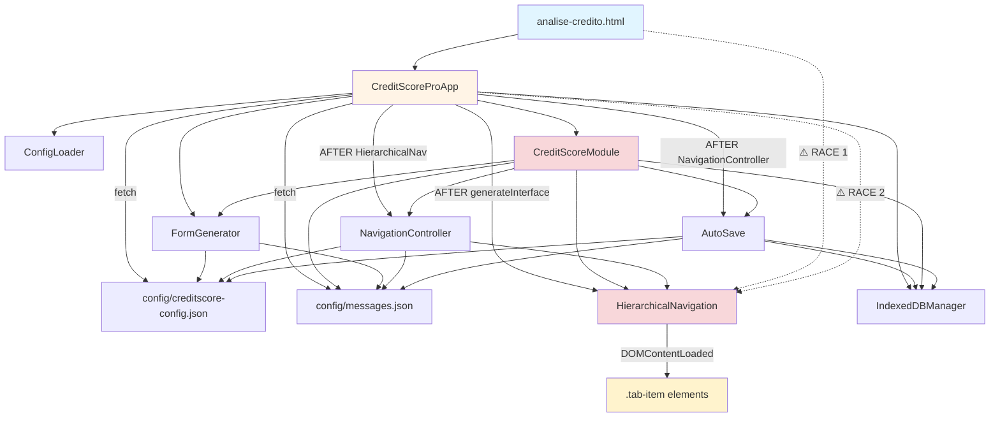

# Análise Arquitetural Completa - CreditScore Pro

**Data:** 2025-10-22
**Versão:** 1.0.0
**Realizada por:** backend-architect agent + debugger agents

---

## 📊 Executive Summary

O sistema CreditScore Pro possui boa arquitetura base mas sofre de **2 problemas críticos** que impedem inicialização, **3 problemas de alta prioridade** que afetam funcionalidade, e diversos problemas de manutenção.

### Problemas Identificados por Severidade

| Severidade | Quantidade | Status |
|------------|------------|--------|
| ⚠️⚠️⚠️ CRÍTICO | 2 | 🔴 Bloqueador |
| ⚠️⚠️ ALTO | 3 | 🟡 Impedem funcionalidade |
| ⚠️ MÉDIO | 3 | 🟢 Manutenção |
| ℹ️ BAIXO | 2 | 🔵 Qualidade |

---

## 🔍 Dependency Graph



---

## ⚠️⚠️⚠️ PROBLEMAS CRÍTICOS (Bloqueadores)

### C1: RACE CONDITION - HierarchicalNavigation Initialization

**Severidade:** CRÍTICO - Bloqueia inicialização
**Localização:**
- `tabs.js:615-622` - DOMContentLoaded auto-initialization
- `analise-credito.html:322-330` - App tenta usar antes de existir

**Problema:**
```javascript
// tabs.js linha 615
document.addEventListener('DOMContentLoaded', () => {
    if (document.getElementById('creditScoreForm')) {
        window.hierarchicalNavigation = new HierarchicalNavigation();
    }
});

// MAS HierarchicalNavigation constructor linha 32-36:
const tabItems = document.querySelectorAll('.tab-item');
if (tabItems.length === 0) {
    throw new Error('HierarchicalNavigation: Nenhuma aba encontrada');
}
// ❌ Tabs ainda não existem quando constructor roda!
```

**Root Cause:**
1. `tabs.js` se auto-inicializa no DOMContentLoaded
2. `CreditScoreProApp` também executa no DOMContentLoaded
3. Ordem de execução não garantida
4. `.tab-item` só é criado por `generateInterface()` linha 373-385

**Ordem ERRADA atual:**
```
DOMContentLoaded dispara
  ├─ tabs.js tenta criar HierarchicalNavigation
  │    └─ Busca .tab-item (NÃO EXISTE) ❌ ERRO
  └─ CreditScoreProApp.init()
       └─ generateInterface() CRIARIA as tabs (tarde demais)
```

**Ordem CORRETA:**
```
DOMContentLoaded dispara
  └─ CreditScoreProApp.init()
       ├─ generateInterface() → CRIA .tab-item
       └─ initNavigationAndDB() → AGORA cria HierarchicalNavigation ✅
```

**Solução:** Remover DOMContentLoaded de tabs.js (linhas 615-623)

---

### C2: DEPENDENCY MISMATCH - CreditScoreModule Constructor

**Severidade:** CRÍTICO - Bloqueia inicialização
**Localização:**
- `creditscore-module.js:14-20` - Constructor signature
- `creditscore-module.js:117-120` - init() espera window.MESSAGES
- `analise-credito.html:307` - Instantiation

**Problema:**
```javascript
// creditscore-module.js linha 15
constructor(config) {
    if (!config) throw new Error(...);
    // Espera apenas config
}

// analise-credito.html linha 307
this.modules.set('creditScore', new window.CreditScoreModule(this.config));
// ✅ Passa apenas config (correto)

// MAS creditscore-module.js linha 117-120 no init():
if (!window.MESSAGES) {
    throw new Error('window.MESSAGES não disponível');
}
this.messages = window.MESSAGES;  // ❌ Global não definido!
```

**Root Cause:**
- `CreditScoreProApp` carrega messages em `this.messages` (local)
- `CreditScoreModule` espera `window.MESSAGES` (global)
- Global nunca é definido → erro na inicialização

**Solução FASE 1 (Temporária):**
```javascript
// analise-credito.html após linha 258
this.messages = await messagesResponse.json();
window.MESSAGES = this.messages;  // ✅ Expor global
```

**Solução FASE 2 (Permanente - Dependency Injection):**
```javascript
// creditscore-module.js
constructor(config, messages) {
    if (!messages) throw new Error(...);
    this.messages = messages;
}

// analise-credito.html linha 307
this.modules.set('creditScore',
    new window.CreditScoreModule(this.config, this.messages)
);
```

---

## ⚠️⚠️ PROBLEMAS DE ALTA PRIORIDADE

### A1: INCONSISTÊNCIA DE EXPORTS - Módulos Core

**Severidade:** ALTO - Dificulta manutenção
**Problema:** Mistura de sistemas de módulos

| Módulo | Export ES6 | Export window | Consistente? |
|--------|-----------|---------------|--------------|
| ConfigLoader | ❌ | ✅ | ❌ |
| FormGenerator | ✅ | ✅ | ✅ |
| NavigationController | ✅ | ✅ | ✅ |
| AutoSave | ✅ | ✅ | ✅ |
| CreditScoreModule | ❌ | ✅ | ❌ |
| HierarchicalNavigation | ❌ | ✅ | ❌ |
| IndexedDBManager | ✅ | ✅ | ✅ |

**Padrão Recomendado:**
```javascript
// 1. ES6 export
export class ModuleName { }

// 2. Global export (retrocompatibilidade)
if (typeof window !== 'undefined') {
    window.ModuleName = ModuleName;
}
```

---

### A2: GLOBAL STATE POLLUTION - window.MESSAGES

**Severidade:** ALTO - Viola SOLID principles
**Problema:** Dependência de estado global não documentado

**Módulos afetados:**
- CreditScoreModule espera `window.MESSAGES`
- Mas apenas `analise-credito.html` define (se corrigido)

**Impacto:**
- ❌ Dificulta testes unitários
- ❌ Polui namespace global
- ❌ Viola Dependency Inversion Principle

**Solução:** Injetar messages via constructor (FASE 2)

---

### A3: EVENT LIFECYCLE INCONSISTENCY

**Severidade:** ALTO - Race conditions
**Problema:** Múltiplos listeners DOMContentLoaded sem coordenação

**Listeners atuais:**
1. `tabs.js:615` - HierarchicalNavigation auto-init
2. `analise-credito.html:545` - CreditScoreProApp.init()

**Ordem não garantida:** JavaScript não garante ordem de execução de listeners DOMContentLoaded no mesmo evento.

**Solução:** Remover auto-init de tabs.js, deixar App gerenciar lifecycle.

---

## ⚠️ PROBLEMAS MÉDIOS (Manutenção)

### M1: DUPLICAÇÃO DE LÓGICA - AutoSave

**Localização:** `auto-save.js:229-269` vs `auto-save.js:355-376`

**Código duplicado:**
```javascript
const saveData = {
    id: 'current_session',
    timestamp: Date.now(),
    moduleId: this.#getCurrentModuleId(),
    formData: this.#collectFormData(),
    completedModules: this.#getCompletedModules(),
    version: this.config.version
};
```

**Solução:** Extrair método `#buildSaveData()`

---

### M2: NOMENCLATURA INCONSISTENTE

**Problema:** Mistura inglês/português, camelCase inconsistente

**Exemplos:**
- `validarConfiguracao()` (português) vs `validateConfig()` (inglês)
- Alguns métodos privados usam `#`, outros não

**Solução:** Padronizar para inglês + camelCase + `#` para private

---

### M3: FALLBACKS - Viola Princípio NO FALLBACKS

**Localização:**
- `auto-save.js:178-200` - Fallback localStorage
- `creditscore-module.js:148-155` - Default autoSaveInterval

**Princípio Violado:** "NO FALLBACKS, NO HARDCODED DATA"

**Solução:** Lançar erro se dependência não disponível (FASE 3)

---

## ℹ️ PROBLEMAS BAIXOS (Qualidade)

### B1: FALTA DE TYPE CHECKING
**Recomendação:** Migrar para TypeScript ou JSDoc + ts-check

### B2: TESTES INEXISTENTES
**Recomendação:** Adicionar testes unitários com Jest ou Vitest

---

## 📋 ORDEM DE EXECUÇÃO IDEAL

### Fluxo Correto de Inicialização

```
1. DOM Ready Event
   ↓
2. CreditScoreProApp Constructor
   ↓
3. CreditScoreProApp.init()
   ├─ 3.1 loadConfig()
   │     ├─ fetch config.json
   │     ├─ fetch messages.json
   │     └─ window.MESSAGES = this.messages ✅
   ├─ 3.2 checkDependencies()
   ├─ 3.3 initBasicModules()
   │     ├─ ConfigLoader(config)
   │     ├─ FormGenerator(config, messages)
   │     └─ CreditScoreModule(config)
   ├─ 3.4 generateInterface()
   │     └─ Cria .tab-item no DOM ✅
   ├─ 3.5 initNavigationAndDB()
   │     ├─ new HierarchicalNavigation() ✅ AGORA SEGURO
   │     └─ new IndexedDBManager()
   ├─ 3.6 initDependentModules()
   │     ├─ NavigationController(config, messages, hierarchicalNav)
   │     └─ AutoSave(config, messages, dbManager)
   ├─ 3.7 setupNavigation()
   ├─ 3.8 setupAutoSave()
   ├─ 3.9 attemptDataRestore()
   └─ 3.10 showInterface()
```

---

## 🎯 ROADMAP DE CORREÇÕES

### FASE 1: Correção de Blockers (AGORA)
**Tempo estimado:** 10-15 minutos

**Mudanças:**
1. Expor `window.MESSAGES` e `window.CONFIG` em loadConfig()
2. Remover DOMContentLoaded de tabs.js
3. Adicionar documentação de ordem de inicialização

**Arquivos modificados:** 2 (analise-credito.html, tabs.js)

---

### FASE 2: Padronização de Arquitetura
**Tempo estimado:** 4 horas

**Objetivos:**
- Padronizar exports (ES6 + window)
- Dependency Injection para messages/config
- Remover dependências de globals
- HierarchicalNavigation.init() explícito

---

### FASE 3: Eliminação de Fallbacks
**Tempo estimado:** 2 horas

**Objetivos:**
- Remover fallback localStorage
- Remover defaults hardcoded
- Validação estrita em todos os módulos

---

### FASE 4: Melhoria de Qualidade
**Tempo estimado:** 8 horas

**Objetivos:**
- JSDoc completo
- Padronizar nomenclatura
- Adicionar testes unitários
- Refatorar CreditScoreModule

---

## 📊 MÉTRICAS DE QUALIDADE

### Complexidade Ciclomática

| Módulo | Linhas | Métodos | Complexidade |
|--------|--------|---------|--------------|
| CreditScoreModule | 750 | 30+ | ⚠️ ALTA |
| FormGenerator | 1200 | 40+ | ⚠️ ALTA |
| NavigationController | 739 | 25+ | ✅ MÉDIA |
| AutoSave | 699 | 20+ | ✅ MÉDIA |
| HierarchicalNavigation | 629 | 25+ | ⚠️ ALTA |

---

## 🏗️ PADRÕES ARQUITETURAIS

### ✅ Patterns Corretos
1. Dependency Injection (NavigationController, AutoSave)
2. Single Responsibility (ConfigLoader, IndexedDBManager)
3. Event-Driven (comunicação via CustomEvents)
4. Factory Pattern (FormGenerator)

### ❌ Anti-Patterns
1. God Object (CreditScoreModule)
2. Global State (window.MESSAGES, window.CONFIG)
3. Hard-to-Test (dependências de DOM)

---

## 🎓 LIÇÕES APRENDIDAS

1. **Race conditions** ocorrem facilmente com múltiplos DOMContentLoaded
2. **Global state** deve ser evitado - usar Dependency Injection
3. **Ordem de inicialização** é crítica - documentar explicitamente
4. **Consistency** de exports facilita manutenção
5. **NO FALLBACKS** é princípio válido - força validação explícita

---

## 📚 REFERÊNCIAS

- **Princípios do Projeto:** NO FALLBACKS, NO HARDCODED DATA, KISS, DRY, SOLID
- **PRD Original:** `/PRD-Sistema de Análise de Crédito e Compliance Financeiro.md`
- **CLAUDE.md:** `/CLAUDE.md`

---

**Última atualização:** 2025-10-22
**Próxima revisão:** Após FASE 2
